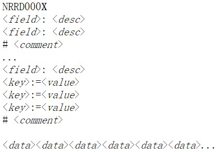
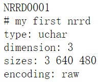

# NRRD文件格式

## 1.一般信息

### 1.1 格式版本
NRRD文件包括两种格式

* 具有附加的标头格式（标头和数据在同一文件中）
* 分离的标头格式（标头和数据存储在两个单独的文件中）

NRRD的常规格式（带有标头）：

第一行的NRRD000X定义了正在被使用的文件格式的版本：

* NRRD0001：最原始和最基本的版本（与NRRD00.01定义共同用于1998年左右的文件）
* NRRD0002：添加了key/Value数对
* NRRD0003：添加了“kinds:” field
* NRRD0004：添加了“thicknesses:”和“sample units”fields，空间和方向信息（“space：”,"space dimension：","space origin：","space units："fields），以及“data file:”field用于标记多个数据文件的功能
* NRRD0005：添加了“measurement frame：”field
  
***

### 1.2 基本Header结构

由于NRRD格式使用多行文本的Header，当Windows（有时是Cygwin）创建文本文件时，每行以一对字符\r\n作为终止。当其他人创建文本文件时，每行以“\n”结尾。NRRD读取器必须能够处理两种类型的行终止字符。

每行 **field：desc** 指定有关nrrd中一个字段的信息，每个字段在NRRD标头文件中最多只能出现一次。

每行 **key:=value** 指定一个键/值对，并且只能出现在NRRD0002及其更高版本的文件中，不能出现在NRRD0001中，key的字符长度至少为一，value的字符长度可以为零。如果key不唯一，则以最后一个存储的value值为唯一value。

注释行以 **#** 开头，带有长度为0的注释字符串的注释行会被忽略。

NRRD格式没有用于所有NRRD标头的标准模板，是由于这些原因变：

* 某些字段（fields）始终是必须的
* 某些字段（fields）始终是可选的
* 某些字段（fields）仅在某些时间是必需的

***
### 1.3 ’per-axis‘ 与 ’basic‘ fields，以及fields的规格顺序

一些fileds会在nrrd中提供有关每个轴（axis）的信息。这些被称为’per-axis fields specifications‘。例如’size：‘ fields，标识了沿着数组的每个维度有多少样本。

一个重要的基本fields是给出nrrd的维度（dimension），格式为：

*dimension: int*

int可以为大于0的任何整数，NRRD读取器必须能够处理维度为16或更小的nrrds。

沿着每个轴的样本数是每个轴唯一必须的uige，其格式为：

sizes: size[0],size[1],...,size[dim-1]

***

### 1.4 轴排序和最小Header

轴排序的问题至关重要。在内存和磁盘中，数组中所有的值都有严格的线性顺序，因此每个值都有一个整数地址。但是从概念上来说，每个值都有一个或者多个整数坐标，这些整数（与数组的维度一样多的坐标）表示了其在数组中的位置。

“最快”轴是与坐标关联的轴，当以线性顺序遍历样本时，坐标轴增加的最快。例如，RGB二维图像数据的典型栅格排序实际上一个三维阵列；而其最快的轴是颜色轴（只有三个样本长），其次是水平轴，最后垂直抽是最慢的。所以轴顺序始终是（由左到右顺序读取）最快到最慢，NRRD不假定轴的任何名称，仅通过其位置从最快到最慢的顺序进行表示。

除了Dimension之外，还有两个始终必须的基本规范：类型和编码格式。其格式为：

*type：xxx* 
*encoding: xxx*

type可以使用C的标识符来表示，例如：’int'表示32位有符号整数，‘float'表示32位浮点数。

encoding表明了如何写出树。’ascii‘和'raw'是常见的值，'hex'允许从某些PostScript文件中提取图像，同时支持压缩。NRRD读取器必须能够支持’ascii‘和’raw‘编码，其他内容都是可选的。

所以根据目前为止描述的最小NRRDHeader如下：

***

## 2.带有数据文件的分离标头
分离的标头允许NRRDheader访问存储在一个或者多个单独文件中的数据，而使得原始文件完整无缺。在这些情况下 *line skip*和*byte skip*fields非常有用。分离的标头在使用直接IO读取或者写入大量数据的情况下也非常有用。分离的标头也是处理不支持可选压缩编码的NRRD阅读器的最简单方法，因为独立程序（例如’gzip/gunzip‘或者’bzip2/bunzip2‘）能够处理单独的数据文件。

***

## 3.空间和方向信息

在NRD0004文件中，NRRD标头可以描述栅格相对于周围某些空间的方向，NRRD标头中的方向信息定义了数组的各个轴与数组的概念上所处的（单个）空间的基本向量之间的关系。

方向信息是由基本和每轴标识来组合定义的，可以完成四件事情：

* 确定数组周围的空间（或者至少确定其齿唇）。完成基本字段规范’space‘和’space dimensions'，以及基本（非每轴）字段规范‘space unit’。
* （可选）确定数组的平移（或者位置）。完成基本字段规范‘space origin:'，该字段规范定位了“第一个”样本。
* 确定数组中每个轴相对于空间的方向。根据每个轴的字段规范’space directions‘完成。
* （可选）对于作为矢量或者具有相对某些特定坐标系测量的系数的矩阵的数量，基本字段规范’measurement frame‘标识从测量框的坐标到数组周围空间的坐标映射。

space:xxxx

| space| space dimension|描述|
|----|----|----|
|'right-anterior-superior' OR 'RAS(右前上)|3|对于医疗数据，表示右手坐标系。此空间用于NIFTI-1扩展到Analyze格式|
|'left-anterior-superior' OR 'LAS'(左前上)|3|对于医疗数据，表示左手坐标系。此空间以Analyze7.5格式使用|
|'left-posterior-superior' OR 'LPS'(左后上)|3|对于医疗数据，表示右手坐标系，该空间用于DICOM3|
|'right-anterior-superior-time' OR'RAST'(右上前时间)|4|像RAS一样，但第四轴有时间维度|
|’left-anterior-superior-time' OR'LAST'(左上前时间)|4|像LAS一样，但第四轴具有时间维度|
|'left-posterior-superior-time' OR'LPST'(左后上时间)|4|像LPS一样，但第四轴具有时间维度|