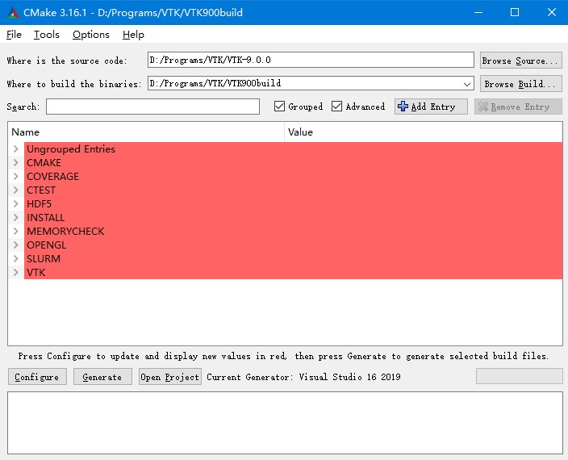
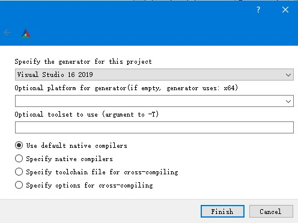
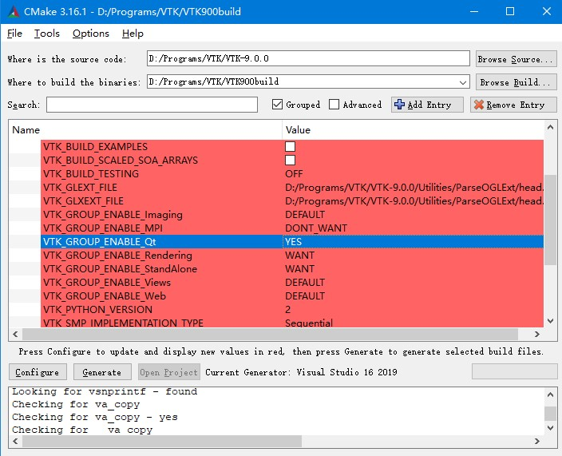
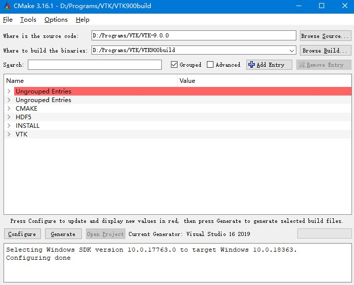
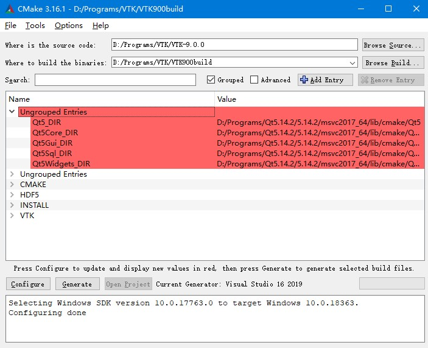
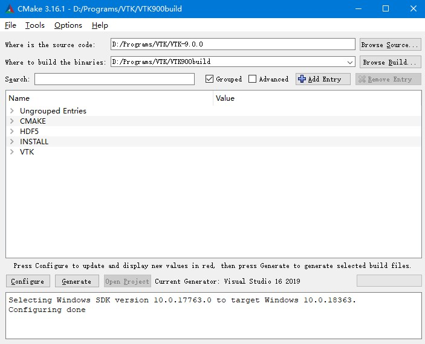
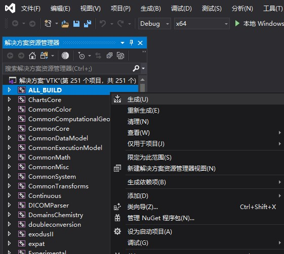

# VTK编译
本文介绍了基于以下环境的VTK的编译方法
* Windows 10
* QT 5.14.2
* MSVS 2019
* VTK 9.0.0
***

## 1.准备工作
vtk的编译需要使用cmake和msvs，cmake是一个跨平台的工程构建工具，其本身并不是一个我们通常理解的编译工具，cmake并不能将sourcecode编译为可执行程序，虽然我们会通俗的说“使用cmake编译”,但是要明白这里区别。cmake的作用是通过解析CMakeLists.txt来生成sln工程（windows环境下）或者makefile（Unix环境下）。所以当一个软件或者SDK的sourcecode需要cmake编译的情况下，通常表明整个软件或者SDK具有跨平台能力。
* ### 所以在windows环境下，我们使用cmake的目的是将vtk的sourcecode转换成msvs可以打开的sln工程
 vtk作为一个库，最终我们要使用的是它的*.dll动态库和*.lib静态库，所以在获得sln工程之后，使用msvs将其编译生成*.dll和*.lib。
* ### 在不考虑跨平台且在windows环境的情况下，使用msvs编译是最优解，使用mingw会出现各种奇怪的问题，所以qt的编译器也要选择msvc（在安装qt的时候进行勾选）
为什么使用qt，自然是为了其丰富以及便利的GUI开发工具，当然使用msvs的mfc、wpf、uwp等也是完全可行的。
***
### 相关下载地址：

一定要注意版本匹配问题：比如较低版本的cmake不支持较高版本的vtk，所以使用目前最高、第二高版本或是LTS(长期支持版本)就一般不会出现这种问题。

vtk的下载地址：https://vtk.org/download/

cmake的下载地址：https://cmake.org/download/

qt的离线安装包下载地址：http://download.qt.io/archive/qt/

msvs的下载地址：https://visualstudio.microsoft.com/zh-hans/vs/
***
## 2.VTK的cmake编译
在获得VTK的源代码后，我们需要通过cmake来将其生成*.sln工程。
首先打开cmake的gui版本，选择源代码目录以及build目录：

点击**Configure**进行首次配置，弹出如下窗口，使用默认设置，点击**finish**：

*等待配置完成*......

配置完成后，进行相关设置，首先勾选VTK_GROUP_ENABLE_Qt, 同时不推荐勾选TESTRING和EXAMPLES,因为会花费大量的编译时间。

然后第二次点击 **Configure** ，进行配置，配置结束后，出现红色警告，如下图：

一般是Qt5_DIR缺失，或者Qt5Core_DIR等子目录缺失，选择对应目录即可，如下图：

随后第三次点击 **Configure** ，进行配置，这一步骤可能需要多次迭代，直到不在出现红色警告条目为止，如下图所示：

点击**Generate**生成*.sln工程，使用camke编译的工作到此完成。
***

## 3.VTK的*.sln工程编译

* 警告： 一定要确保使用管理员权限打开VS，否则会导致后续操作出现错误

使用vs打开build目录下的*.sln工程，将ALL_BUILD设为启动项，并点击生成：

